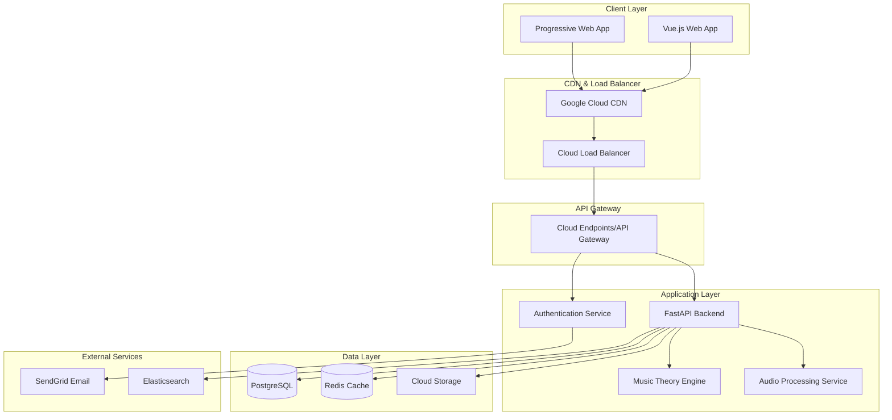
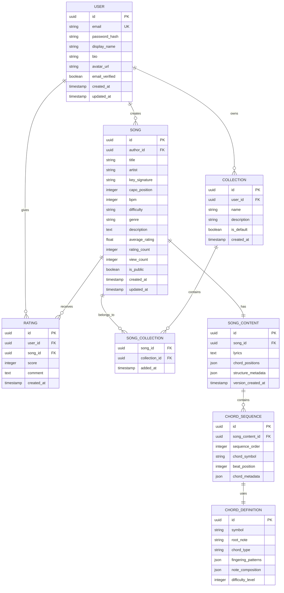
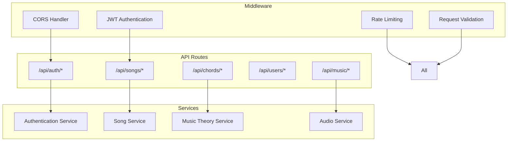
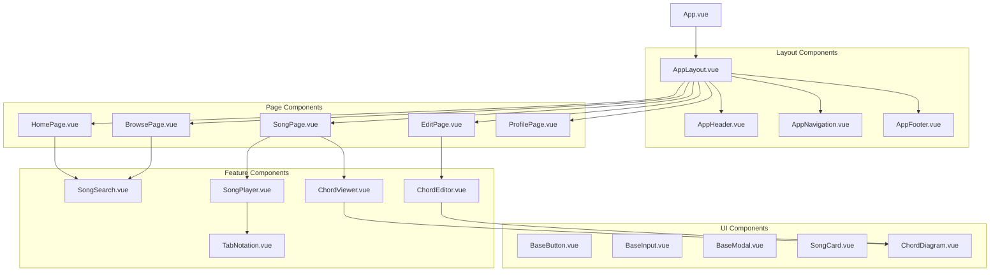
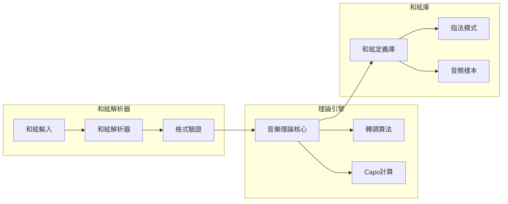

# MyChordHub 平台技術設計文件

## 1. 系統架構概覽

### 1.1 整體架構設計
MyChordHub 採用現代化的前後端分離架構，基於 Vue.js + Python + PostgreSQL 的技術棧，部署於 Google Cloud Platform。



### 1.2 技術棧詳細規劃

**前端技術**
- **Vue 3** + Composition API：現代化的組件開發
- **Vite**：快速開發和構建工具
- **TypeScript**：類型安全的開發體驗
- **Pinia**：狀態管理
- **Vue Router**：路由管理
- **Tailwind CSS**：響應式UI框架
- **VueUse**：實用的組合式函數庫

**後端技術**
- **FastAPI**：高性能的 Python Web 框架
- **SQLAlchemy**：ORM 數據庫操作
- **Alembic**：數據庫遷移管理
- **Redis**：緩存和會話存儲
- **Celery**：異步任務處理

**基礎設施**
- **Google Cloud Platform**：雲平台
- **Cloud Run**：容器化部署
- **Cloud SQL**：託管 PostgreSQL
- **Cloud Storage**：文件存儲
- **Cloud CDN**：內容分發

## 2. 數據模型設計

### 2.1 核心實體關係圖



### 2.2 詳細數據結構

**和絃定義擴展結構**
```json
{
  "chord_symbol": "Am7",
  "fingering_patterns": [
    {
      "id": "am7_basic",
      "name": "基本按法",
      "frets": [0, 0, 2, 0, 1, 0],
      "fingers": [0, 0, 2, 0, 1, 0],
      "difficulty": 2,
      "is_default": true
    }
  ],
  "note_composition": {
    "root": "A",
    "third": "C",
    "fifth": "E",
    "seventh": "G"
  },
  "alternative_names": ["Am7", "A-7", "Amin7"]
}
```

**歌曲內容元數據結構**
```json
{
  "structure": {
    "intro": {"start": 0, "end": 8},
    "verse1": {"start": 8, "end": 24},
    "chorus": {"start": 24, "end": 40},
    "verse2": {"start": 40, "end": 56},
    "bridge": {"start": 56, "end": 64},
    "outro": {"start": 64, "end": 72}
  },
  "chord_positions": [
    {
      "line": 1,
      "position": 0,
      "chord": "Am",
      "duration": 4
    }
  ],
  "playback_settings": {
    "default_bpm": 120,
    "scroll_speed": 1.0,
    "auto_scroll_enabled": true
  }
}
```

## 3. API 接口設計

### 3.1 API 架構設計



### 3.2 核心 API 端點規劃

**用戶認證 API**
```
POST   /api/auth/register          # 用戶註冊
POST   /api/auth/login             # 用戶登入
POST   /api/auth/logout            # 用戶登出
POST   /api/auth/refresh           # 刷新令牌
POST   /api/auth/verify-email      # 驗證郵箱
POST   /api/auth/reset-password    # 重設密碼
```

**歌曲管理 API**
```
GET    /api/songs                  # 歌曲列表（分頁、搜索、篩選）
POST   /api/songs                  # 創建歌曲
GET    /api/songs/{id}             # 獲取歌曲詳情
PUT    /api/songs/{id}             # 更新歌曲
DELETE /api/songs/{id}             # 刪除歌曲
GET    /api/songs/{id}/content     # 獲取歌曲內容
PUT    /api/songs/{id}/content     # 更新歌曲內容
POST   /api/songs/{id}/rate        # 評分歌曲
```

**和絃與音樂理論 API**
```
GET    /api/chords                 # 和絃庫查詢
GET    /api/chords/{symbol}        # 獲取和絃定義
POST   /api/chords/transpose       # 和絃轉調
POST   /api/chords/suggest         # 和絃建議
GET    /api/music/scales           # 音階查詢
POST   /api/music/analyze          # 歌曲音樂分析
```

**用戶個人化 API**
```
GET    /api/users/profile          # 獲取個人資料
PUT    /api/users/profile          # 更新個人資料
GET    /api/users/collections      # 獲取收藏夾列表
POST   /api/users/collections      # 創建收藏夾
PUT    /api/users/collections/{id} # 更新收藏夾
DELETE /api/users/collections/{id} # 刪除收藏夾
POST   /api/users/collections/{id}/songs/{song_id}  # 添加歌曲到收藏夾
DELETE /api/users/collections/{id}/songs/{song_id}  # 從收藏夾移除歌曲
```

### 3.3 API 響應格式標準

**成功響應格式**
```json
{
  "success": true,
  "data": {
    "songs": [...],
    "pagination": {
      "page": 1,
      "size": 20,
      "total": 150,
      "pages": 8
    }
  },
  "message": "操作成功"
}
```

**錯誤響應格式**
```json
{
  "success": false,
  "error": {
    "code": "VALIDATION_ERROR",
    "message": "輸入數據驗證失敗",
    "details": {
      "email": ["郵箱格式不正確"],
      "password": ["密碼長度至少8位"]
    }
  }
}
```

## 4. 前端組件架構

### 4.1 組件層次結構



### 4.2 核心組件詳細設計

**SongPlayer.vue - 歌曲播放器組件**
```vue
<template>
  <div class="song-player">
    <!-- 播放控制區 -->
    <div class="player-controls">
      <PlayButton @click="togglePlay" :is-playing="isPlaying" />
      <SpeedSlider v-model="playbackSpeed" :min="0.5" :max="2.0" />
      <ProgressBar :progress="progress" @seek="seekTo" />
    </div>
    
    <!-- 歌詞顯示區 -->
    <div class="lyrics-container" ref="lyricsContainer">
      <LyricsLine 
        v-for="(line, index) in lyrics" 
        :key="index"
        :line="line" 
        :is-active="index === currentLine"
        @chord-click="showChordDiagram"
      />
    </div>
    
    <!-- 和絃圖彈窗 -->
    <ChordModal 
      v-if="selectedChord" 
      :chord="selectedChord" 
      @close="selectedChord = null" 
    />
  </div>
</template>

<script setup lang="ts">
import { ref, computed, onMounted, onUnmounted } from 'vue'
import { useSongPlayer } from '@/composables/useSongPlayer'
import type { Song, ChordPosition } from '@/types'

interface Props {
  song: Song
  autoPlay?: boolean
}

const props = defineProps<Props>()
const emit = defineEmits<{
  progressUpdate: [progress: number]
  lineChange: [lineIndex: number]
}>()

const {
  isPlaying,
  playbackSpeed,
  progress,
  currentLine,
  togglePlay,
  seekTo,
  updateProgress
} = useSongPlayer(props.song)

// 組件邏輯實現...
</script>
```

**ChordEditor.vue - 和絃編輯器組件**
```vue
<template>
  <div class="chord-editor">
    <!-- 工具欄 -->
    <div class="editor-toolbar">
      <KeySelector v-model="currentKey" @change="handleKeyChange" />
      <CapoSelector v-model="capoPosition" @change="handleCapoChange" />
      <ActionButtons @save="saveChanges" @cancel="cancelEditing" />
    </div>
    
    <!-- 編輯區域 -->
    <div class="editor-content">
      <textarea 
        v-model="songContent" 
        class="lyrics-input"
        @input="handleContentChange"
        placeholder="在此輸入歌詞，在歌詞上方一行輸入和絃..."
      />
      
      <!-- 和絃建議面板 -->
      <ChordSuggestions 
        v-if="showSuggestions"
        :suggestions="chordSuggestions"
        :position="suggestionPosition"
        @select="insertChord"
        @close="hideSuggestions"
      />
    </div>
    
    <!-- 預覽區域 -->
    <div class="editor-preview">
      <SongViewer :content="parsedContent" :key="currentKey" :capo="capoPosition" />
    </div>
  </div>
</template>

<script setup lang="ts">
import { ref, computed, watch } from 'vue'
import { useChordEditor } from '@/composables/useChordEditor'
import { useChordSuggestions } from '@/composables/useChordSuggestions'

// 編輯器邏輯實現...
</script>
```

### 4.3 狀態管理設計

**Pinia Store 架構**
```typescript
// stores/auth.ts
export const useAuthStore = defineStore('auth', () => {
  const user = ref<User | null>(null)
  const token = ref<string | null>(null)
  const isAuthenticated = computed(() => !!token.value)
  
  const login = async (credentials: LoginCredentials) => {
    // 登入邏輯
  }
  
  const logout = () => {
    // 登出邏輯
  }
  
  return { user, token, isAuthenticated, login, logout }
})

// stores/songs.ts
export const useSongsStore = defineStore('songs', () => {
  const songs = ref<Song[]>([])
  const currentSong = ref<Song | null>(null)
  const searchResults = ref<Song[]>([])
  
  const fetchSongs = async (params: SearchParams) => {
    // 獲取歌曲列表
  }
  
  const getSong = async (id: string) => {
    // 獲取單個歌曲
  }
  
  return { songs, currentSong, searchResults, fetchSongs, getSong }
})

// stores/music.ts
export const useMusicStore = defineStore('music', () => {
  const chordLibrary = ref<ChordDefinition[]>([])
  const currentKey = ref<string>('C')
  const capoPosition = ref<number>(0)
  
  const transposeChord = (chord: string, semitones: number) => {
    // 和絃轉調邏輯
  }
  
  const getChordDiagram = (chordSymbol: string) => {
    // 獲取和絃圖邏輯
  }
  
  return { chordLibrary, currentKey, capoPosition, transposeChord, getChordDiagram }
})
```

## 5. 音樂理論引擎設計

### 5.1 和絃處理系統



**Python 音樂理論核心實現架構**
```python
# music_theory/core.py
class MusicTheoryEngine:
    """音樂理論引擎核心類"""
    
    def __init__(self):
        self.note_mapping = {
            'C': 0, 'C#': 1, 'Db': 1, 'D': 2, 'D#': 3, 'Eb': 3,
            'E': 4, 'F': 5, 'F#': 6, 'Gb': 6, 'G': 7, 'G#': 8,
            'Ab': 8, 'A': 9, 'A#': 10, 'Bb': 10, 'B': 11
        }
        self.chord_patterns = self._load_chord_patterns()
    
    def transpose_chord(self, chord_symbol: str, semitones: int) -> str:
        """和絃轉調"""
        root, chord_type = self._parse_chord(chord_symbol)
        new_root = self._transpose_note(root, semitones)
        return f"{new_root}{chord_type}"
    
    def calculate_capo_effect(self, original_key: str, capo_position: int) -> str:
        """計算變調夾效果"""
        return self._transpose_note(original_key, capo_position)
    
    def get_chord_suggestions(self, key: str, context: list) -> list:
        """基於調性和上下文建議和絃"""
        scale_chords = self._get_scale_chords(key)
        return self._rank_suggestions(scale_chords, context)

# music_theory/chord_parser.py
class ChordParser:
    """和絃解析器"""
    
    CHORD_REGEX = re.compile(
        r'^([A-G][#b]?)'  # 根音
        r'(m|maj|min|dim|aug|sus[24]?)?'  # 基本類型
        r'([67]|9|11|13)?'  # 延伸音
        r'(add[2469]|omit[35])?'  # 添加/省略
        r'(/[A-G][#b]?)?$'  # 轉位
    )
    
    def parse(self, chord_symbol: str) -> ChordInfo:
        """解析和絃符號"""
        match = self.CHORD_REGEX.match(chord_symbol.strip())
        if not match:
            raise InvalidChordError(f"無法解析和絃: {chord_symbol}")
        
        return ChordInfo(
            root=match.group(1),
            quality=match.group(2) or 'maj',
            extension=match.group(3),
            modification=match.group(4),
            bass=match.group(5)
        )
```

### 5.2 六線譜渲染系統

**前端六線譜組件設計**
```typescript
// components/TabNotation.vue
interface TabNotation {
  frets: number[]  // [3, 2, 0, 1, 0, 0] 代表各弦的品位
  fingers: number[] // [3, 2, 0, 1, 0, 0] 代表使用的手指
  tuning: string[] // ['E', 'A', 'D', 'G', 'B', 'E'] 標準調弦
}

export class TabRenderer {
  private canvas: HTMLCanvasElement
  private ctx: CanvasRenderingContext2D
  
  constructor(canvas: HTMLCanvasElement) {
    this.canvas = canvas
    this.ctx = canvas.getContext('2d')!
  }
  
  renderChordDiagram(chord: TabNotation, options: RenderOptions = {}) {
    this.clearCanvas()
    this.drawFretboard(options.frets || 5)
    this.drawFingerPositions(chord.frets, chord.fingers)
    this.drawStringNames(chord.tuning)
    this.drawFretNumbers()
  }
  
  private drawFretboard(frets: number) {
    // 繪製品絲和琴弦
    const stringSpacing = this.canvas.width / 6
    const fretSpacing = this.canvas.height / (frets + 1)
    
    // 繪製琴弦（垂直線）
    for (let i = 0; i <= 5; i++) {
      const x = stringSpacing * (i + 0.5)
      this.drawLine(x, 0, x, this.canvas.height)
    }
    
    // 繪製品絲（水平線）
    for (let i = 0; i <= frets; i++) {
      const y = fretSpacing * i
      this.drawLine(0, y, this.canvas.width, y)
    }
  }
  
  private drawFingerPositions(frets: number[], fingers: number[]) {
    // 繪製手指按壓位置
    frets.forEach((fret, stringIndex) => {
      if (fret > 0) {
        const x = this.getStringPosition(stringIndex)
        const y = this.getFretPosition(fret)
        this.drawFingerDot(x, y, fingers[stringIndex])
      }
    })
  }
}
```

## 6. 自動播放與音頻系統

### 6.1 自動滾動實現

```typescript
// composables/useSongPlayer.ts
export function useSongPlayer(song: Song) {
  const isPlaying = ref(false)
  const playbackSpeed = ref(1.0)
  const currentLine = ref(0)
  const progress = ref(0)
  
  let animationFrame: number
  let startTime: number
  let pausedTime = 0
  
  const lineTimings = computed(() => {
    // 根據 BPM 和歌詞計算每行的時間點
    return calculateLineTimings(song.lyrics, song.bpm)
  })
  
  const togglePlay = () => {
    if (isPlaying.value) {
      pause()
    } else {
      play()
    }
  }
  
  const play = () => {
    isPlaying.value = true
    startTime = performance.now() - pausedTime
    updateProgress()
  }
  
  const pause = () => {
    isPlaying.value = false
    cancelAnimationFrame(animationFrame)
    pausedTime = performance.now() - startTime
  }
  
  const updateProgress = () => {
    if (!isPlaying.value) return
    
    const currentTime = (performance.now() - startTime) * playbackSpeed.value
    progress.value = currentTime / getTotalDuration()
    
    // 更新當前行
    const newLine = getCurrentLine(currentTime, lineTimings.value)
    if (newLine !== currentLine.value) {
      currentLine.value = newLine
      scrollToLine(newLine)
    }
    
    animationFrame = requestAnimationFrame(updateProgress)
  }
  
  const scrollToLine = (lineIndex: number) => {
    const lineElement = document.querySelector(`[data-line="${lineIndex}"]`)
    if (lineElement) {
      lineElement.scrollIntoView({
        behavior: 'smooth',
        block: 'center'
      })
    }
  }
  
  return {
    isPlaying,
    playbackSpeed,
    currentLine,
    progress,
    togglePlay,
    play,
    pause
  }
}
```

### 6.2 音頻處理系統

```python
# audio/generator.py
class ChordAudioGenerator:
    """和絃音頻生成器"""
    
    def __init__(self):
        self.sample_rate = 44100
        self.note_frequencies = self._generate_note_frequencies()
    
    def generate_chord_audio(self, chord_symbol: str, duration: float = 2.0) -> bytes:
        """生成和絃音頻"""
        chord_notes = self.music_theory.get_chord_notes(chord_symbol)
        frequencies = [self.note_frequencies[note] for note in chord_notes]
        
        # 生成音頻波形
        audio_data = self._generate_guitar_chord(frequencies, duration)
        
        # 轉換為 WAV 格式
        return self._to_wav_bytes(audio_data)
    
    def _generate_guitar_chord(self, frequencies: list, duration: float) -> np.ndarray:
        """生成吉他和絃音頻"""
        t = np.linspace(0, duration, int(self.sample_rate * duration))
        chord_wave = np.zeros_like(t)
        
        for freq in frequencies:
            # 使用 Karplus-Strong 算法模擬吉他音色
            note_wave = self._karplus_strong_synthesis(freq, duration)
            chord_wave += note_wave * 0.3  # 混合各個音符
        
        # 應用 ADSR 包絡
        envelope = self._apply_adsr_envelope(chord_wave, duration)
        return chord_wave * envelope
    
    def _karplus_strong_synthesis(self, frequency: float, duration: float) -> np.ndarray:
        """Karplus-Strong 吉他合成算法"""
        # 實現 Karplus-Strong 演算法
        pass
```

## 7. 響應式設計策略

### 7.1 斷點設計

```scss
// styles/breakpoints.scss
$breakpoints: (
  'mobile': 320px,
  'mobile-lg': 480px,
  'tablet': 768px,
  'tablet-lg': 1024px,
  'desktop': 1200px,
  'desktop-lg': 1440px
);

// Tailwind 配置
module.exports = {
  theme: {
    screens: {
      'sm': '480px',   // mobile-lg
      'md': '768px',   // tablet
      'lg': '1024px',  // tablet-lg
      'xl': '1200px',  // desktop
      '2xl': '1440px'  // desktop-lg
    }
  }
}
```

### 7.2 適應性組件設計

```vue
<!-- components/ResponsiveLayout.vue -->
<template>
  <div class="responsive-layout">
    <!-- 手機版佈局 -->
    <div v-if="isMobile" class="mobile-layout">
      <MobileHeader />
      <MobileNavigation />
      <main class="mobile-content">
        <slot />
      </main>
    </div>
    
    <!-- 平板/桌面版佈局 -->
    <div v-else class="desktop-layout">
      <aside class="sidebar">
        <DesktopNavigation />
      </aside>
      <main class="main-content">
        <DesktopHeader />
        <div class="content-area">
          <slot />
        </div>
      </main>
    </div>
  </div>
</template>

<script setup lang="ts">
import { useBreakpoints } from '@vueuse/core'

const breakpoints = useBreakpoints({
  mobile: 0,
  tablet: 768,
  desktop: 1024
})

const isMobile = breakpoints.smaller('tablet')
const isTablet = breakpoints.between('tablet', 'desktop')
const isDesktop = breakpoints.greater('desktop')
</script>
```

## 8. 性能優化策略

### 8.1 前端性能優化

**代碼分割與懶載入**
```typescript
// router/index.ts
const routes = [
  {
    path: '/',
    name: 'Home',
    component: () => import('@/views/HomePage.vue')
  },
  {
    path: '/browse',
    name: 'Browse',
    component: () => import('@/views/BrowsePage.vue')
  },
  {
    path: '/song/:id',
    name: 'Song',
    component: () => import('@/views/SongPage.vue')
  },
  {
    path: '/edit/:id?',
    name: 'Edit',
    component: () => import('@/views/EditPage.vue')
  }
]

// 組件懶載入
const ChordModal = defineAsyncComponent({
  loader: () => import('@/components/ChordModal.vue'),
  loadingComponent: LoadingSpinner,
  delay: 200,
  timeout: 3000
})
```

**虛擬滾動實現**
```vue
<!-- components/VirtualSongList.vue -->
<template>
  <div 
    class="virtual-list" 
    :style="{ height: containerHeight + 'px' }"
    @scroll="handleScroll"
  >
    <div :style="{ height: totalHeight + 'px', position: 'relative' }">
      <SongCard
        v-for="song in visibleSongs"
        :key="song.id"
        :song="song"
        :style="{
          position: 'absolute',
          top: getItemTop(song._index) + 'px',
          left: 0,
          right: 0
        }"
      />
    </div>
  </div>
</template>

<script setup lang="ts">
import { ref, computed, onMounted } from 'vue'

const props = defineProps<{
  songs: Song[]
  itemHeight: number
  containerHeight: number
}>()

const scrollTop = ref(0)
const buffer = 5

const totalHeight = computed(() => props.songs.length * props.itemHeight)

const visibleRange = computed(() => {
  const start = Math.floor(scrollTop.value / props.itemHeight)
  const end = Math.min(
    start + Math.ceil(props.containerHeight / props.itemHeight) + buffer,
    props.songs.length
  )
  return { start: Math.max(0, start - buffer), end }
})

const visibleSongs = computed(() => {
  return props.songs
    .slice(visibleRange.value.start, visibleRange.value.end)
    .map((song, index) => ({
      ...song,
      _index: visibleRange.value.start + index
    }))
})
</script>
```

### 8.2 後端性能優化

**Redis 緩存策略**
```python
# services/cache.py
class CacheService:
    def __init__(self, redis_client):
        self.redis = redis_client
        self.default_ttl = 3600  # 1小時
    
    async def get_song(self, song_id: str) -> Optional[Song]:
        """獲取緩存的歌曲"""
        cached = await self.redis.get(f"song:{song_id}")
        if cached:
            return Song.parse_raw(cached)
        return None
    
    async def set_song(self, song: Song, ttl: int = None):
        """緩存歌曲"""
        await self.redis.setex(
            f"song:{song.id}",
            ttl or self.default_ttl,
            song.json()
        )
    
    async def get_search_results(self, query: str, filters: dict) -> Optional[list]:
        """獲取搜索結果緩存"""
        cache_key = f"search:{hashlib.md5(f'{query}:{filters}'.encode()).hexdigest()}"
        cached = await self.redis.get(cache_key)
        if cached:
            return json.loads(cached)
        return None

# API 端點中的使用
@app.get("/api/songs/{song_id}")
async def get_song(song_id: str, cache: CacheService = Depends()):
    # 首先嘗試從緩存獲取
    song = await cache.get_song(song_id)
    if song:
        return song
    
    # 從數據庫查詢
    song = await db.get_song(song_id)
    if song:
        # 緩存結果
        await cache.set_song(song)
    
    return song
```

**數據庫查詢優化**
```python
# models/optimized_queries.py
class OptimizedSongQueries:
    
    @staticmethod
    async def get_songs_with_pagination(
        db: AsyncSession,
        page: int = 1,
        size: int = 20,
        search: str = None,
        filters: dict = None
    ):
        """優化的分頁查詢"""
        query = select(Song).options(
            selectinload(Song.author),  # 預載入作者信息
            selectinload(Song.ratings)  # 預載入評分
        )
        
        # 搜索條件
        if search:
            search_vector = func.to_tsvector('english', 
                Song.title + ' ' + Song.artist + ' ' + Song.description
            )
            query = query.where(
                search_vector.match(func.plainto_tsquery('english', search))
            )
        
        # 篩選條件
        if filters:
            if filters.get('key'):
                query = query.where(Song.key_signature == filters['key'])
            if filters.get('difficulty'):
                query = query.where(Song.difficulty == filters['difficulty'])
        
        # 計算總數（使用窗口函數避免額外查詢）
        query = query.add_columns(
            func.count().over().label('total_count')
        )
        
        # 分頁
        offset = (page - 1) * size
        query = query.offset(offset).limit(size)
        
        result = await db.execute(query)
        return result.all()
```

## 9. 安全性設計

### 9.1 認證與授權

```python
# security/auth.py
class JWTAuthenticator:
    def __init__(self, secret_key: str, algorithm: str = "HS256"):
        self.secret_key = secret_key
        self.algorithm = algorithm
        self.access_token_expire = timedelta(minutes=30)
        self.refresh_token_expire = timedelta(days=30)
    
    def create_access_token(self, user_id: str, permissions: list = None):
        """創建訪問令牌"""
        expire = datetime.utcnow() + self.access_token_expire
        payload = {
            "sub": user_id,
            "exp": expire,
            "type": "access",
            "permissions": permissions or []
        }
        return jwt.encode(payload, self.secret_key, algorithm=self.algorithm)
    
    def create_refresh_token(self, user_id: str):
        """創建刷新令牌"""
        expire = datetime.utcnow() + self.refresh_token_expire
        payload = {
            "sub": user_id,
            "exp": expire,
            "type": "refresh"
        }
        return jwt.encode(payload, self.secret_key, algorithm=self.algorithm)
    
    async def verify_token(self, token: str) -> Optional[TokenPayload]:
        """驗證令牌"""
        try:
            payload = jwt.decode(token, self.secret_key, algorithms=[self.algorithm])
            return TokenPayload(**payload)
        except jwt.ExpiredSignatureError:
            raise TokenExpiredError()
        except jwt.JWTError:
            raise InvalidTokenError()

# 權限裝飾器
def require_permission(permission: str):
    def decorator(func):
        async def wrapper(*args, **kwargs):
            current_user = get_current_user()
            if permission not in current_user.permissions:
                raise PermissionDeniedError()
            return await func(*args, **kwargs)
        return wrapper
    return decorator
```

### 9.2 輸入驗證與清理

```python
# security/validation.py
class InputValidator:
    
    @staticmethod
    def validate_chord_input(chord_text: str) -> str:
        """驗證和清理和絃輸入"""
        # 移除潛在的危險字符
        safe_text = re.sub(r'[<>"\'\x00-\x1f\x7f-\x9f]', '', chord_text)
        
        # 限制長度
        if len(safe_text) > 10000:
            raise ValidationError("和絃文本過長")
        
        # 驗證和絃格式
        lines = safe_text.split('\n')
        for line in lines:
            if not re.match(r'^[A-G#b/0-9\s\-majsudim+()]*$', line):
                raise ValidationError("包含無效的和絃字符")
        
        return safe_text
    
    @staticmethod
    def sanitize_html(text: str) -> str:
        """清理 HTML 內容"""
        return bleach.clean(
            text,
            tags=['b', 'i', 'strong', 'em', 'br', 'p'],
            attributes={},
            strip=True
        )

# API 端點中的使用
@app.post("/api/songs")
async def create_song(song_data: SongCreate, current_user: User = Depends(get_current_user)):
    # 驗證輸入
    song_data.title = InputValidator.sanitize_html(song_data.title)
    song_data.lyrics = InputValidator.validate_chord_input(song_data.lyrics)
    
    # 創建歌曲
    song = await SongService.create_song(song_data, current_user.id)
    return song
```

## 10. 部署架構設計

### 10.1 Google Cloud Platform 部署策略

```yaml
# infrastructure/docker-compose.yml
version: '3.8'

services:
  frontend:
    build: 
      context: ./frontend
      dockerfile: Dockerfile
    ports:
      - "3000:3000"
    environment:
      - VITE_API_URL=http://api:8000
    depends_on:
      - api

  api:
    build:
      context: ./backend
      dockerfile: Dockerfile
    ports:
      - "8000:8000"
    environment:
      - DATABASE_URL=postgresql://user:pass@db:5432/mychord
      - REDIS_URL=redis://redis:6379/0
      - JWT_SECRET_KEY=${JWT_SECRET_KEY}
    depends_on:
      - db
      - redis

  db:
    image: postgres:14
    environment:
      - POSTGRES_DB=mychord
      - POSTGRES_USER=user
      - POSTGRES_PASSWORD=pass
    volumes:
      - postgres_data:/var/lib/postgresql/data
    ports:
      - "5432:5432"

  redis:
    image: redis:7-alpine
    ports:
      - "6379:6379"
    volumes:
      - redis_data:/data

volumes:
  postgres_data:
  redis_data:
```

**Cloud Run 部署配置**
```yaml
# infrastructure/cloudrun-service.yml
apiVersion: serving.knative.dev/v1
kind: Service
metadata:
  name: mychord-api
  annotations:
    run.googleapis.com/ingress: all
spec:
  template:
    metadata:
      annotations:
        autoscaling.knative.dev/minScale: "1"
        autoscaling.knative.dev/maxScale: "100"
        run.googleapis.com/cpu-throttling: "false"
    spec:
      containerConcurrency: 80
      containers:
      - image: gcr.io/project-id/mychord-api:latest
        ports:
        - containerPort: 8000
        env:
        - name: DATABASE_URL
          valueFrom:
            secretKeyRef:
              name: database-secret
              key: url
        - name: REDIS_URL
          valueFrom:
            secretKeyRef:
              name: redis-secret
              key: url
        resources:
          requests:
            memory: "512Mi"
            cpu: "1000m"
          limits:
            memory: "1Gi"
            cpu: "2000m"
```

### 10.2 CI/CD 流水線

```yaml
# .github/workflows/deploy.yml
name: Deploy to GCP

on:
  push:
    branches: [main]

jobs:
  test:
    runs-on: ubuntu-latest
    steps:
      - uses: actions/checkout@v3
      
      - name: Set up Python
        uses: actions/setup-python@v3
        with:
          python-version: 3.11
      
      - name: Install dependencies
        run: |
          pip install -r requirements.txt
          pip install pytest pytest-cov
      
      - name: Run tests
        run: pytest --cov=./ --cov-report=xml
      
      - name: Upload coverage
        uses: codecov/codecov-action@v3

  build-and-deploy:
    needs: test
    runs-on: ubuntu-latest
    steps:
      - uses: actions/checkout@v3
      
      - name: Set up Cloud SDK
        uses: google-github-actions/setup-gcloud@v0
        with:
          project_id: ${{ secrets.GCP_PROJECT_ID }}
          service_account_key: ${{ secrets.GCP_SA_KEY }}
      
      - name: Build and push Docker image
        run: |
          docker build -t gcr.io/${{ secrets.GCP_PROJECT_ID }}/mychord-api:${{ github.sha }} .
          docker push gcr.io/${{ secrets.GCP_PROJECT_ID }}/mychord-api:${{ github.sha }}
      
      - name: Deploy to Cloud Run
        run: |
          gcloud run deploy mychord-api \
            --image gcr.io/${{ secrets.GCP_PROJECT_ID }}/mychord-api:${{ github.sha }} \
            --platform managed \
            --region us-central1 \
            --allow-unauthenticated
```

## 11. 監控與日誌

### 11.1 應用監控

```python
# monitoring/metrics.py
from prometheus_client import Counter, Histogram, Gauge
import time

# 定義指標
REQUEST_COUNT = Counter(
    'http_requests_total',
    'Total HTTP requests',
    ['method', 'endpoint', 'status']
)

REQUEST_DURATION = Histogram(
    'http_request_duration_seconds',
    'HTTP request duration'
)

ACTIVE_USERS = Gauge(
    'active_users_total',
    'Number of active users'
)

SONG_PLAYS = Counter(
    'song_plays_total',
    'Total song plays',
    ['song_id']
)

# 中介軟體
@app.middleware("http")
async def monitor_requests(request: Request, call_next):
    start_time = time.time()
    
    response = await call_next(request)
    
    # 記錄指標
    REQUEST_COUNT.labels(
        method=request.method,
        endpoint=request.url.path,
        status=response.status_code
    ).inc()
    
    REQUEST_DURATION.observe(time.time() - start_time)
    
    return response
```

### 11.2 結構化日誌

```python
# logging/structured_logger.py
import structlog
import sys

def configure_logging():
    structlog.configure(
        processors=[
            structlog.stdlib.filter_by_level,
            structlog.stdlib.add_logger_name,
            structlog.stdlib.add_log_level,
            structlog.stdlib.PositionalArgumentsFormatter(),
            structlog.processors.TimeStamper(fmt="iso"),
            structlog.processors.StackInfoRenderer(),
            structlog.processors.format_exc_info,
            structlog.processors.UnicodeDecoder(),
            structlog.processors.JSONRenderer()
        ],
        context_class=dict,
        logger_factory=structlog.stdlib.LoggerFactory(),
        wrapper_class=structlog.stdlib.BoundLogger,
        cache_logger_on_first_use=True,
    )

# 使用範例
logger = structlog.get_logger()

@app.post("/api/songs")
async def create_song(song_data: SongCreate):
    logger.info(
        "Creating new song",
        user_id=current_user.id,
        song_title=song_data.title,
        song_key=song_data.key_signature
    )
    
    try:
        song = await SongService.create_song(song_data)
        logger.info(
            "Song created successfully",
            song_id=song.id,
            duration_ms=(time.time() - start_time) * 1000
        )
        return song
    except Exception as e:
        logger.error(
            "Failed to create song",
            error=str(e),
            error_type=type(e).__name__
        )
        raise
```

---

## 總結

這個技術設計文件提供了 MyChordHub 平台的完整技術架構，涵蓋了：

1. **系統架構**：基於 Vue.js + FastAPI + PostgreSQL 的現代化三層架構
2. **數據模型**：完整的音樂數據結構設計，支援複雜的和絃理論
3. **API 設計**：RESTful API 規範，支援完整的 CRUD 操作
4. **前端架構**：組件化設計，響應式佈局，優秀的用戶體驗
5. **音樂理論引擎**：強大的和絃轉調、Capo 計算等功能
6. **性能優化**：前後端全方位的性能優化策略
7. **安全性**：完善的認證授權和輸入驗證機制
8. **部署架構**：基於 GCP 的雲原生部署方案

所有設計都遵循了需求文件中的 EARS 格式驗收標準，確保每個功能都有明確的實現目標。該架構具有良好的可擴展性和維護性，能夠支撐平台的長期發展。

接下來是否需要進入任務規劃階段？